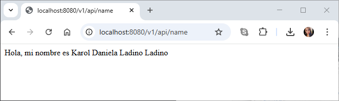
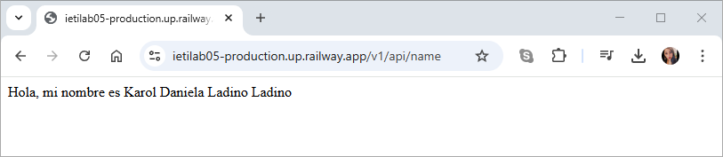

# Despliegue App Spring Boot con Github y Raylway.app


Se implementa un microservicio REST con Spring Boot que envia como respuesta un nombre y se despliega con Raylway.

### Ejecución

**1. Local**

Para acceder de manera local utilice la siguiente url:

```
http://localhost:8080/v1/api/name
```



**2. Despliegue**

Para el despliegue utilice la siguiente url:

```
https://ietilab05-production.up.railway.app/v1/api/name
```



---

## Autor

* **[Karol Daniela Ladino Ladino](https://www.linkedin.com/in/karol-daniela-ladino-ladino-55164b272/)** - [20042000](https://github.com/20042000)


## Licencia
**©** Karol Daniela Ladino Ladino. Estudiante de Ingeniería de Sistemas de la Escuela Colombiana de Ingeniería Julio Garavito